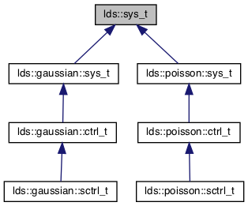

# ldsCtrlEst
`ldsCtrlEst` is a C++ library for estimation and control of linear dynamical systems (LDS) with Gaussian or Poisson observations. It is meant to provide the functionality necessary to implement feedback control of linear dynamical systems experimentally. This library was originally developed for the task of controlling neuronal activity using spike count data as feedback and optogenetic inputs for control. However, the methods are generally applicable.

This library currently provides three namespaces.
 - `lds` : linear dynamical systems (without output/observations)
 - `lds::gaussian` (AKA `glds`) : linear dynamical systems with Gaussian observations
 - `lds::poisson` (AKA `plds`) : linear dynamical systems with Poisson observations

*Future iterations may include an additional namespace for LDS with Bernoulli observations (`lds::bernoulli`).*

# Project Scope
The goal of this project is to provide necessary functions to implement feedback control of linear dynamical systems experimentally: *i.e.*, online estimation of state feedback and calculation of control signal updates. Given its intended use in experiments, the library seeks to be **practical** in all things and thus includes optional features such as adaptive estimation of a process disturbance to improve robustness in state estimation and a mechanism for combatting integrator windup with control signal saturation. For cases where the system to be controlled is not adequately modeled as having linear dynamics but has multiple quasi-linear operating modes, a "switched" control scheme is also implemented. It switches between multiple controllers tuned for each operating mode of the physical system as it changes. It also includes options to toggle on/off feedback control and state estimation independently, which can be practically useful when testing the components of the control system. Moreover, to avoid the need for numerical integration of continuous-time models, all state-space models used here are discrete-time.

Generally, the `ldsCtrlEst` library does **not** endeavor to provide functionality for things that can be carried out offline/before experiments. For example, it does not design controller gains. Given a model of the system to be controlled, these parameters may be optimized before experimental application in most cases, and there are numerous options available to scientists/engineers in languages such as Matlab and Python for design. An exception to this guiding principle to project scope is the included code for fitting state-space models to data. Currently this fitting portion of the library is a configurable option, but in future releases this may migrate to a separate project as it is not intended for online use.

Among other things, this project also does not provide methods for trajectory optimization, linearization of nonlinear models, or other methods related to nonlinear control, with the exception of the nonlinear state estimator for Poisson-output LDS models.

# Repository Design


- All dynamical systems *with observations* (Gaussian, Poisson) are built upon class definitions for the underlying linear dynamical system (`lds::sys_t`).
- In each namespace, there are generic system types defined (`lds::sys_t`, `lds::gaussian::sys_t`, `lds::poisson::sys_t`) that include functionality for one-step prediction, etc.
- Additionally, in namespaces with observation equations (`lds::gaussian`,`lds::poisson`), system types include functionality for updating estimates of states, given current measurements (*i.e.*, filtering).
- In namespaces for systems with observation equations (`lds::gaussian`,`lds::poisson`), controller types (`ctrl_t`) are built on top of that namespace's system type. Feedback control functionality (as well as previously-defined online state estimation) is provided by these controller types.
- In order to ensure dimensionalities always match internally and to use intention in handling any mismatches that may be present in parameters, signals, etc., every property of a system/controller class is `protected`. Where appropriate, set methods are defined so users can define parameters in a safe way. Get methods are also provided for most signals/parameters.

# Repository Organization
- Header files are located under `include/ldsEstCtrl_h`.
- Source files are located under `src/` (main source code) and `src-fit/` (model fitting-related source code).
- Wrappers for exposing functions to Matlab as executables (mex) are located under `matlab/`. Currently, only fitting functions of the library are exposed for use in Matlab.
- Complimentary Matlab functions for control and estimation are also located under `matlab/`. They are provided as methods of `GLDS` and `PLDS` class definitions.
- Example programs and visualization scripts are located under `examples/`.
- Example programs that demonstrate how to use ldsCtrlEst in other projects are provided in `misc/`. See `misc/test-cmake-installation` for a project that uses `cmake` to configure your project build and `misc/test-pkgconfig-installation` which is the same but uses a hand-written Makefile and calls to pkg-config. As the names suggest, building these programs is a simple way to test your installation of ldsCtrlEst.

# Dependencies
Note that the primary dependencies of this project listed below must be installed along with their header files and with CMake config files *or* pkg-config files. The latter files are used to configure this project's build. It is strongly encouraged to install the dependencies below using a package manager (*e.g.*, apt, pacman, macports).

- For project configuration, install [`cmake`](https://cmake.org/) as well as [`pkg-config`](https://gitlab.freedesktop.org/pkg-config/pkg-config). The latter is optional.
- The linear algebra library [`armadillo`](http://arma.sourceforge.net/) is used throughout this repository.
- The [HDF5](https://www.hdfgroup.org/downloads/hdf5/) library is used to save output from example test programs.
- For use of this library in Matlab executables (mex) on Linux operating systems, you will need [OpenBlas](http://www.openblas.net/), ensuring the *static* library `libopenblas.a` is installed. You will also need to install [`gfortran`](https://gcc.gnu.org/fortran/).

# Compilation + Installation
This project is configured/compiled/installed by way of CMake and (on Unix-based operating systems) GNU Make. For configuration with CMake, there are three available options.
1. `LDSCTRLEST_BUILD_EXAMPLES`  : [default= ON] whether to build example programs located under `examples/` in the source tree
2. `LDSCTRLEST_BUILD_FIT`       : [default=OFF] whether to build the auxiliary fitting portion of the source code that is not pertinent to control implementation
3. `LDSCTRLEST_BUILD_STATIC`    : [default=OFF] whether to statically link against OpenBLAS and create a static ldsCtrlEst library for future use

*n.b., If both options 2 and 3 are enabled, Matlab/Octave mex functions will be compiled for exposing some of the fitting functionality to Matlab/Octave.*

Below are example usages of `cmake`/`make` to configure/build the library.
- For basic project build & install
	```shell
	cd /path/to/repository
	mkdir build && cd build
	cmake .. #configure build
	make #build the project
	sudo make install #[optional] installs to default location (OS-specific)
	```

- To set the install prefix
	```shell
	cd /path/to/repository
	mkdir build && cd build
	cmake -DCMAKE_INSTALL_PREFIX=/your/install/prefix .. #configure build with chosen install location
	make #build the project
	make install #install to /your/install/prefix
	```

- To build the *entire* project including fit code, a static library for Matlab compatibility, and the included Matlab `mex` functions for fitting GLDS/PLDS models.
	```shell
	cd /path/to/repository
	mkdir build && cd build
	cmake -DLDSCTRLEST_BUILD_FIT=1 -DLDSCTRLEST_STATIC_OPENBLAS=1 .. #configure to build the fitting portion of library and statically link openblas and ldsCtrlEst to mex files
	make #build the project
	```

	*n.b.*, If you choose not to install the library or install it to the non-default location, ensure you have updated the following environment variables on Unix-based operating systems.
	1. `LD_LIBRARY_PATH`: search path for dynamically loaded libraries
	2. `PKG_CONFIG_PATH`: search path for `pkg-config` tool
	3. `CMAKE_PREFIX_PATH`: search path of prefix where CMake will look for package config files

	*e.g.*, Assuming you set `-DCMAKE_INSTALL_PREFIX=/your/install/prefix` during project configuration and your login shell uses the `~/.profile` startup file, open `~/.profile` in a text editor and add ...
	```shell
	export LD_LIBRARY_PATH=$LD_LIBRARY_PATH:/your/install/prefix/lib
	export PKG_CONFIG_PATH=$PKG_CONFIG_PATH:/your/install/prefix/lib/pkgconfig
	export CMAKE_PREFIX_PATH=$CMAKE_PREFIX_PATH:/your/install/prefix
	```

## Common issues

1. "I have installed all the dependencies including `gfortran` with a package manager as suggested; however, `cmake` complains it cannot find the `gfortran` library."

	When `gfortran` is installed, its library is usually *not* installed in a standard location like `/usr/lib`. `gfortran` is part of the `gcc` suite, so their libraries are organized together. e.g., When you install `gfortran` on Ubuntu using `apt`, its location is `/usr/lib/gcc/x86_64-linux-gnu/9`, in the case that `gcc` version 9 is installed. The build configuration script in ldsCtrlEst is written to add `LD_LIBRARY_PATH` (Unix) or `PATH` (Windows) to the CMake library search path on Unix or Windows systems, respectively. Therefore, to fix this issue, simply add the directory in which `libgfortran` was installed to the OS-appropriate environment variable. Continuing with the Ubuntu example above and assuming a Unix login shell whose startup file is `~/.profile`, add the following to the file.
	```shell
	export LD_LIBRARY_PATH=$LD_LIBRARY_PATH:/usr/lib/gcc/x86_64-linux-gnu/9
	```

2. "I have built the library and installed it in a non-default location. In building my own project linking against `ldsCtrlEst`, `cmake` or `pkg-config` cannot find the library or its configuration information."

	If `cmake` and/or `pkg-config` cannot find the required configuration files for your project to link against ldsCtrlEst, make sure that these utilities know to look for them in the non-default location where you installed the library. For `cmake` this means adding your chosen install prefix to the environment variable `CMAKE_PREFIX_PATH`. Similarly, for `pkg-config` you need to add `your/install/prefix/lib/pkgconfig` to its search path, `PKG_CONFIG_PATH`. Assuming a Unix shell whose login startup file is `~/.profile` and ldsCtrlEst was installed using prefix `your/install/prefix`, add the following to `.profile`.
	```shell
	export CMAKE_PREFIX_PATH=$CMAKE_PREFIX_PATH:/your/install/prefix
	export PKG_CONFIG_PATH=$PKG_CONFIG_PATH:/your/install/prefix
	```

# Acknowledgements

Development and publication of this library was supported in part by the NIH/NINDS Collaborative Research in Computational Neuroscience (CRCNS)/BRAIN Grant 5R01NS115327-02.
